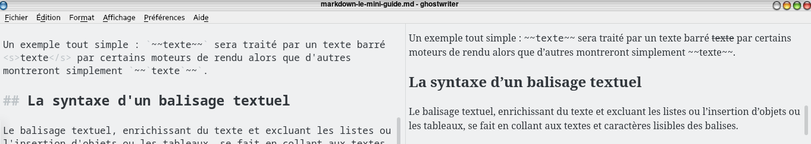
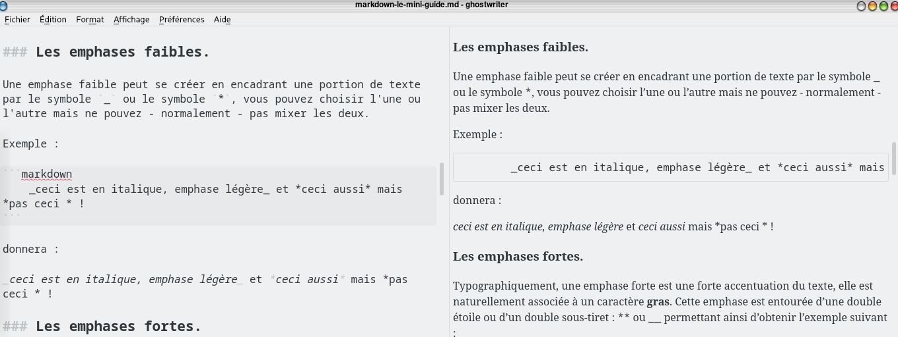
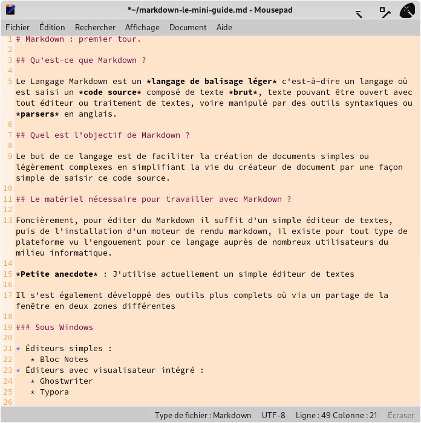
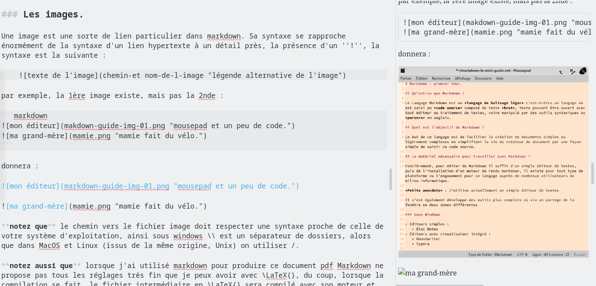
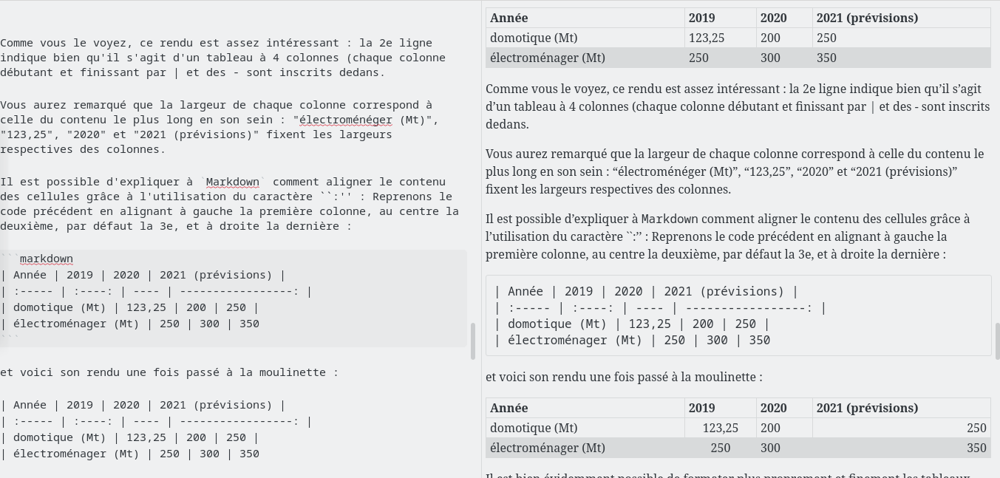
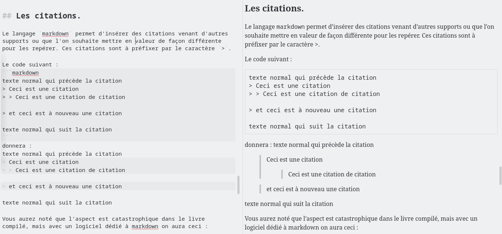
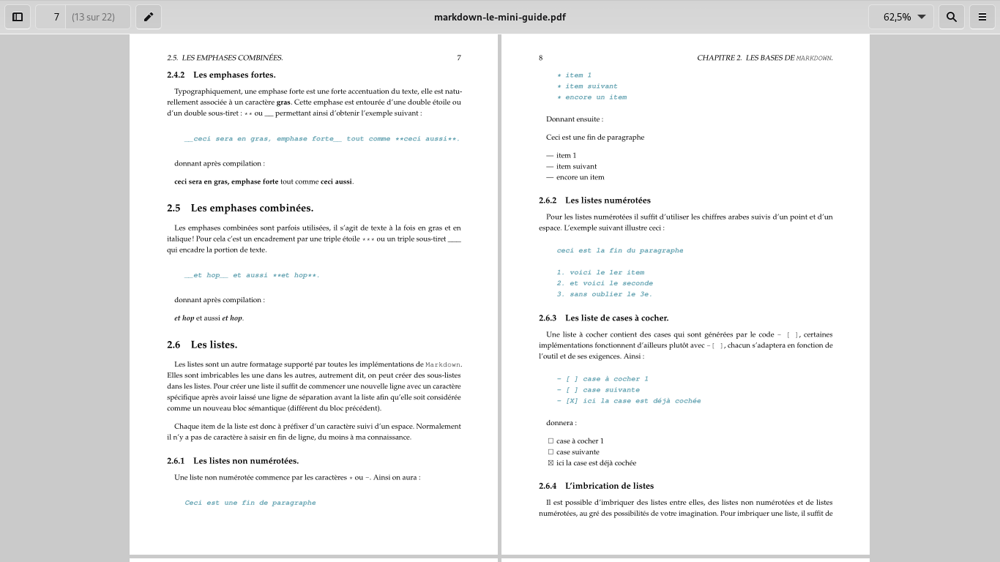
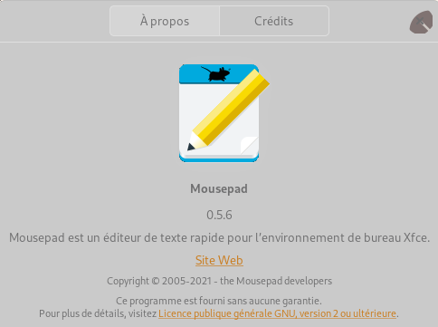
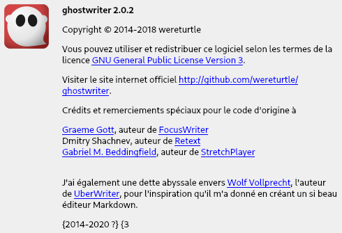

# `Markdown` : Vista general.

Esta parte contiene variios pensamientos e ideas relativas al idioma informático llamado `markdown` y por supuesto es bastante personal, también se puede mejorar, rectificar y matizar en **absoluto** con lo que cada uno traerá con si mismo.

## ¿ Qué es `Markdown` ?

El idioma `Markdown` es un *idioma de balizaje legero*, me vengo a referir un idioma donde se ingresa un *código fuente* compuesto de texto *puro*, texto que se puede leer con cualquier éditor o procesador de textos, o que se pueda manipular con herramientas sintácticas también llamados *parsers* en inglés.

Los caracteres ingresados suelen ser codificados en unos de los códigos universales informáticos llamado UTF-8.

Para cualquier persona descubriendolo, esta noción de código fuente se refiere a la programación informática donde el programa ejecutandose[^application] es un archivo binario solo compuesto de 0 y 1 que no tienen sentido para un ser humano y el código fuente es un texto comprensible por un humano conociendo el idioma utilizado. Esta noción de código fuente es un gran invento introducido en los años 1960 por **Grace Hopper** que inventó en primer *compilador*[^compilateur] cuyo papel es traducir el código fuente en programa binario. Desde entonces el programor ya no necesita traducir en idioma máquina (los 0 y 1 que la compudatora comprende) su programa antes de ingresarlo en la computadora sino escribe el código fuente con un editor, el compilador se encarga de traducirlo automatícamente en idioma máquina comprensible por el ordenador.

## ¿ Qué objectivo tiene `Markdown` ?

L meta de este idioma es facilitar la creación de documentos sencillos o ligeramente  complejos simplificando el trabajo del creador del documento con un modo facilitado y con un modo sencillo y relativamente elegante de ingresar este código fuente. Sin embargo, cuidado, este funcionamiento puede ser muy confuso si usted no disocia en su pernsar la forma del documento y el contenido ; cuando uno ingresa el código fuente del documento en Markdown con una herramienta ultrabásica tal como el sencillo bloc de notas, le formateo no aparece inmediatamente[^formatagedirect].

`Markdown` no es un procesador de textos como actualmente se admete. No se comporta como `Word` de *Microsoft*, `Writer` de *Libreoffice* o `Pages` de *Apple*, este idioma no se comporte como estos procesadores de textos que clasifico dans la familia de los **wysiwyg**[^wysiwyg] pero en la de los **wyciwym**[^wyciwym] ; 
se tiene que comprender como un documento conteniendo balizajes semánticos, es de decir marcadores indicando el sentido del texto escrito, rodeando précédent o un bloc o una linea de texto.

Al separar la estética de un documento y el sentido del contenido, se puede trabajar mas libremente sobre el contenido, liberándose el espíritu, reduciendo al mínimo el formateo y concentrandose sobre el sentido que se quiere meter en el contenido, despues se produce el documento formateado. Esta separación permite además otros aspectos interesantes medioambientales, escribiré a proposito mas alla en la parte [markdown y medio ambiente]{#markdown-environnement}.

También existen otros idiomas semánticos, el más conocido es el *HTML* contenido en las páginas web, desde mucho tiempo extendido con otros tal como JavaScript, PHP, etc..., y en el dominio de la publicación, no se puede olvidar \LaTeX{} o `asciidoc`.

<!-- fín actual de traducción temporal -->

L'éditeur spécial markdown utilise un autre outil qu'il intègre de façon transparente pour l'utilisateur, este que je désignerai par l'expression de *moteur de rendu*.

Vous pourrez noter qu'con le temps et la pratique au moins deux situations différentes non-exclusives s'ouvriront à vous :

+ vous aurez atteint un niveau suffisant de compréhension du markdown, modifiant votre perception du code que vous pourrez lire quasiment directement sans avoir besoin de rendu, je vous avoue que ça m'arrive même désormais con \LaTeX{}.
+ vous finirez au gré des échanges par trouver un éditeur qui offrira une visualisation directe séparée - como ghostwriter o retext - o directe - typora, abricotine, apostrophe - de este que vous saisissez, certains ayant même des icônes, à la façon d'un Libreoffice o d'un Office, pour formater.

## Le matériel nécessaire pour travailler con `Markdown` ?

Foncièrement, pour éditer du `Markdown` il suffit d'un sencillo/a éditeur de textes[^editor], puis de l'installation d'un moteur de rendu markdown, il existe pour tout type de plateforme vu l'engouement pour este idioma auprès de nombreux utilisateurs du milieu informatique.

*Petite anecdote* : J'utilise actuellement un sencillo/a éditeur de textes, appelé *mousepad*, qui es muy sencillo/a dans ses fonctionnalités mais contient exactement celles dont j'ai besoin pour écrire o programmer.

Il s'est également développé des outils plus complets où via un partage de la fenêtre en deux zones différentes, certains plus lourds, d'autres aussi légers.

### Multiplateformes

Plutôt que de les inclure dans leur système respectif, je pose ici les logiciels et leur site de référence cuando ceux ci-sont développés sur plusieurs plateformes en reprenant les indications des sites le jour où je les ai inclus o le jour o je les ai revérifiés :

+ abricotine <http://abricotine.brrd.fr/> , MacOSX (en béta), Linux et Windows (7 o +), attention, cuando je l'ai compilé sur un ordenador pour le tester, il a fallu installer *nodejs* este qui me semble relativement lourd.
+ typora <https://typora.io> es un logiciel qui formate à la volée le code que vous saisissez
+ ghostwriter <https://wereturtle.github.io/ghostwriter/> un éditeur où s'affiche par défaut le code mais permet aussi de scinder la fenêtre en deux pour avoir le rendu à droite. C'est *aussi* celui que j'utilise.

### Sous Windows

* Éditeurs sencillo/as :
	* Bloc Notes

### Sous Mac OS

* Éditeurs sencillo/as :

### Sous Linux

* Éditeurs sencillo/as :
	* emacs
	* vi, vim, gvim, neovim,
	* nano
	* etc... (il existe des dizaines d'éditeurs sencillo/as)
	* Leafpad
	* Geany
	* Mousepad
	* Apostrophe (partie des GNOME-Apps)
	* GEdit
	* Pluma
* Éditeurs con visualisateur intégré :
	* ReText
	* SublimeText (demande un numéro de licence à acheter)
	* Abricotine
	* Apostrophe

Les éditeurs de texto permettent de ingresar du code, c'est à dire un texto fait de caractères bruts o codés de façon totalement universelle. Un code écrit con n'importe quel éditeur puede ser ouvert con n'importe quel autre o un procesador de textos ...

### Markdown et environnement : un peu de légèreté. {markdown-environnement}

L'informatique es connue pour être un secteur coûteux et *extrêmement* polluant. Tout le monde n'a pas les moyens de se payer un ordenador récent et puissant aussi souvent que les programmes les plus *en vogue* demandent des ressources, mais nombre d'utilisateurs ont des ordenadors un peu voire muy âgés, c'est un phénomène constaté au quotidien.

Grâce à este type d'outil que sont les éditeurs **wyciwym** vous pouvez utiliser un ordenador même hors d'âge - sans exagérer non plus - pour composer le contenu o sa plus grosse partie et compiler ensuite le rendu sur place o sur un poste un peu plus puissant, l'éditeur étant normalement et sauf exception, un programme d'empreinte énergétique faible nécessitant des ressources matérielles modestes.

L'utilisation d'un sencillo/a éditeur de textes, tels que mousepad, leafpad, gedit, emacs, kate, pluma, geany, vi(m) ... permet de travailler con une empreinte énergétique légère. La tendance actuelle évolue cependant : on comonce à avoir des éditeurs au rendu direct -- o pas -- consommant de plus en plus de ressources énergétiques. Tant que la liberté es laissée et que chaque personne a *le choix* de pouvoir utiliser l'une o l'autre des solutions pour composer rien ne vient me gêner.

*Petite anecdote* : Je compose sur une machine de 12 ans d'âge où la seule modification a été d'augmenter la mémoire vive afin qu'il exécute un système récent.

Pour produire este documento, l'éditeur qui es utilisé près de 95 % du temps utilise peu de puissance, cuando j'ai besoin de voir le rendu, le código fuente de este documento es alors passé dans une moulinette automatique double qui va le transformer en documento tel que vous le lisez. Certaines captures d'écran ultérieures vous montreront des exemples de código fuente / rendu con l'un des logiciels que j'utilise. C'est à este moment-là que les ressources énergétiques sont nécessaires.

Ce découplage entre la saisie et la creación du documento formaté permet justement de réduire le besoin de ressources : si vous n'éditez plus le documento en cours de creación, l'énergie même modeste utilisée par l'éditeur es libérée et disponible pour la compilation et contrairement à l'idée naturelle incitant à penser que cela prend plus de temps ça no es le cas.

Certes, sur le moment, entre saisie et génération esto/as temps ne sont pas parallèles mais sont suivis, cependant, lorsqu'une machine es vraiment modeste, la saisie en même temps que son apperçu, pour de muy gros documentos, peut ralentir à este point une machine que la saisie devient asynchrone con son apperçu : qui n'a jamais connu un moment où l'ordenador n'en peut tellement plus que vous saisissez une phrase et qu'elle apparaît en un bloc une fraction de seconde plus tard voire plusieurs secondes après ?

Dans toutes les configurations, cela permet de gagner - malgré les apparences - du temps. C'est d'ailleurs une chose que nombre de gens utilisant les procesadores de textos ne savent plus faire car ils n'ont pas pris este temps en amont pour utiliser les *styles* o définir des *modèles* pour ensuite se concentrer sur la saisie de documentos ayant une homogénéité de présentation sur sa globalité.

# Les bases de `Markdown`.

Dans cette partie sont vues les principes et objectifs de `Markdown` ainsi que les éléments de base de formatage des documentos con les balizajes usuelles et leurs variantes.

## Généralités et objectifs

Le idioma `Markdown` sait prendre en charge des formatages sencillo/as, il peut ainsi travailler con des emphases plus o moins fortes, des listes numérotées o non, des cases à cocher o des tableaux élémentaires ainsi que l'insertion de liens o d'images, mais aussi l'insertion de citations, de bouts de codes o de listings informatiques et quelques spécificités. esto/as syntaxes basiques peuvent être augmentées par l'ajout d'autres codes issus de idiomas différents, ceci sera traité à la partie idoine.

Dans cette partie j'exposerai les formatages basiques concernés. Il es important de comprendre qu'ici certains *mauvais* réflexes sont à perdre. Ainsi je ne parlerai pas d'italique mais d'emphase légère et je ne parlerai plus de gras mais d'emphase forte. esto/as terminologies sont issues de la typographie classique, qu'on retrouve également dans d'autres idiomas tels que \TeX{}, \LaTeX{} o CON\TeX{} par exemple.

Avant de poursuivre, notez que `Markdown` es un idioma qui a été développé un peu par à-coups, son côté minimaliste et sa licence libre en a fait un idioma *forké*, il existe de nombreuses implémentations de `Markdown` qui sont désignées como des ``saveurs'' (*flavours* en anglais). Cela se traduit par un fait sencillo/a : parfois certains éditeurs o moteurs de rendu ne traduisent pas toutes les balizajes car ils s'appuient sur une saveur n'implémentant pas cette balizaje.

Un exemple tout sencillo/a : `~~texte~~` sera traité par un texto barré <s>texte</s> par certains moteurs de rendu alors que d'autres montreront sencillo/ament `~~`texte`~~`. D'ailleurs la figure "Même aperçu de balisage dans ghostwriter" vous montre une capture d'écran partielle permettant de voir un balisage où le texto es bien barré par l'utilisation des balizajes `~~`



## La syntaxe d'un balisage textuel

Le balisage textuel, enrichissant du texto et excluant les listes o l'insertion d'objets o les tableaux, se fait en collant aux textos et caractères lisibles des balizajes.

**Attention :** Un espace no es un caractère pour le balisage, aussi si vous voulez mettre en italique le mot bidule par exemple, este code-ci `*bidule*` fonctionnera alors que celui-là `*bidule *` ne fonctionnera pas du fait de la présence d'un espace.

## Les titres, sous-titres et organisation hiérarchique.

Chaque ligne de titre, sous-titre, sous-sous-titre etc... jusqu'au 5e o 6e niveau hiérarchique suivant les logiciels et implémentations es à préfixer con un o plusieurs caractères `#`.

Ainsi `# le titre` sera le titre du documento, `## le sous-titre` le sous-titre, etc... Voici un exemple de code que je ne génèrerai pas visuellement pour ne pas perturber la numérotation des paragraphes en cours :

```markdown
	# titre du documento
	
	bla bla bla
	
	## sous titre 
	
	re bla bla bla 
	
	## autre sous-titre
	
	### sous-sous titre
	
	bla bla bla bla
	
	### encore un sous-sous titre
	
	bla bla bla
	
	## un dernier sous-titre
	
	bla bla bla
```

Lors de la compilation, les hiérarchies de titres ne sont pas numérotées, sauf à passer le paramètre `--number-sections` à la commande en charge de la compilation du documento. C'est este qui a été fait ici pour la numérotation de toutes les sections, sous-sections et sous-sous-sections, les titres principaux ayant été attribués par une commande supplémentaire aux titres de chapitres.

## Les paragraphes

Un paragraphe dans markdown comonce à un début de ligne. Une fois le paragraphe fini, il suffit de sauter deux lignes pour comoncer le suivant.

Exemple :

```markdown
Ceci es un début de paragraphe bla bla bla bla bla ...
	
Ceci es le paragraphe suivant bla bla bla bla bla ...
```

donnera :

Ceci es un début de paragraphe bla bla bla bla bla ...
	
Ceci es le paragraphe suivant bla bla bla bla bla ...

J'ai souvent tendance à considérer les paragraphes como un bloc sémantique, *ou objet*, tout como une liste en es un autre, une image aussi.

## Les emphases.

Les enphases sont typographiquement des mises en valeur de portions de textes. esto/as emphases sont *faibles* o **fortes** et peuvent se coder de deux façons différentes.

### Les emphases faibles.

Une emphase faible peut se crear en encadrant une portion de texto par le symbole `_` o le symbole `*`, vous pouvez choisir l'une o l'autre mais ne pouvez - normalement - pas mixer les deux.

Exemple :

```markdown
_ceci es en italique, emphase légère_ et *ceci aussi* ¬
 mais *pas ceci * et encore moins *ceci_ !
```

donnera :

_ceci es en italique, emphase légère_ et *ceci aussi* mais *pas ceci * et encore moins *ceci_ !

La compilation via *pdflatex* pour obtenir le documento *pdf* semblant parfois avoir un comportement non conforme à celui attendu par un moteur de rendu html, la capture "Emphases faibles dans ghostwriter" vous montrera à sa droite un aperçu plus conforme à la norme `Markdown`.



### Les emphases fortes.

Typographiquement, une emphase forte es une forte accentuation du texte, elle es naturellement associée à un caractère **gras**. Cette emphase es entourée d'une double étoile o d'un double sous-tiret : `**` o `__` permettant ainsi d'obtenir l'exemple suivant :

```markdown
__ceci sera en gras, emphase forte__ tout como **ceci aussi**.
```

donnant après compilation :

__ceci sera en gras, emphase forte__ tout como **ceci aussi**.

## Les emphases combinées.

Les emphases combinées sont parfois utilisées, il s'agit de texto à la fois en gras et en italique ! Pour cela c'est un encadrement par une triple étoile `***` o un triple sous-tiret `___` qui encadre la portion de texte.

```markdown
___et hop___ et aussi ***et hop***.
```

donnant après compilation :

___et hop___ et aussi ***et hop***.

## Les listes.

Les listes sont un autre formatage supporté par toutes les implémentations de `Markdown`. Elles sont imbricables les une dans les autres, autrement dit, on peut crear des sous-listes dans les listes. Pour crear une liste il suffit de comoncer une nouvelle ligne con un caractère spécifique après avoir laissé une ligne de séparation avant la liste afin qu'elle soit considérée como un nouveau bloc sémantique (différent du bloc précédent).

Chaque item de la liste es donc à préfixer d'un caractère suivi d'un espace. Normalement il n'y a pas de caractère à ingresar en fin de ligne, du moins à ma connaissance.

### Les listes non numérotées.

Une liste non numérotée comonce par les caractères `*`, `+` o `-`. Ainsi on aura :

```markdown
Ceci es une fin de paragraphe

* item 1
* item suivant
* encore un item
```

Donnant ensuite :

Ceci es une fin de paragraphe
	
* item 1
* item suivant
* encore un item

### Les listes numérotées

Pour les listes numérotées il suffit d'utiliser les chiffres arabes suivis d'un point et d'un espace. L'exemple suivant illustre ceci :

```markdown
ceci es la fin du paragraphe

1. voici le 1er item
2. et voici le seconde
3. sans oublier le 3e.
```

Ce qui donnera le rendu suivant :

ceci es la fin du paragraphe

1. voici le 1er item
2. et voici le seconde
3. sans oublier le 3e.

### Les liste de cases à cocher.

Une liste à cocher contient des cases qui sont générées par le code `- [ ] `, certaines implémentations fonctionnent d'ailleurs plutôt con `-[ ] `, chacun s'adaptera en fonction de l'outil et de ses exigences. Ainsi :

```markdown
- [ ] case à cocher 1
- [ ] case suivante
- [X] ici la case es déjà cochée
```

donnera le visuel suivant :

- [ ] case à cocher 1
- [ ] case suivante
- [X] ici la case es déjà cochée

Vous me demanderez quizás pourquoi cette dernière case cochée (je le vois dans votre regard sur l'écran) ? Tout sencillo/ament car il existe des programmes o des applications qui permettent de crear des listes dynamiques (tâches, courses, ...) s'appuyant sur `Markdown` permettant dans un mode de visualisation de cocher o décocher les cases.

### L'imbrication de listes

Il es possible d'imbriquer des listes entre elles, des listes non numérotées et de listes numérotées, au gré des possibilités de votre imagination. Pour imbriquer une liste, il suffit de décaler par tabulation les lignes avant de comoncer à ingresar le balisage. Par exemple :

```markdown
1. bla bla truc
2. machin chose
	1. exemple
	2. autre exemple.
3. exacte solution
	* sous exemple
	* sous exemple suivant sans ordre
4. traitement du n'importe quoi
	1. sous exemple
	2. autre sous exemple
		* encore un exemple
		* sans oublier celui-ci
	3. Continuons.
5. revenons au début.
```

donnera :

1. bla bla truc
2. machin chose
	1. exemple
	2. autre exemple.
3. exacte solution
	* sous exemple
	* sous exemple suivant sans ordre
4. traitement du n'importe quoi
	1. sous exemple
	2. autre sous exemple
		* encore un exemple
		* sans oublier celui-ci
	3. Continuons.
5. revenons au début.


## Les liens et images.

Il peut sembler étrange que je range dans la même partie les liens et les images, n'en soyez pas étonné(e), cela vient sencillo/ament du formatage utilisé par `Markdown` pour les insérer dans le documento.

Avant de comoncer este documento, je tiens à signaler que le caractère "¬" qui apparaît parfois dans les listings de code sert à signaler que la ligne de code continue à la ligne suivante mais es saisie en continu dans le monde réel.

Dernier point avant d'attaquer este qui suit : la conversion par `pdflatex` calcule la position optimale d'une image dans un documento afin de rendre son contenu agréable à l'œil, aussi certaines images peuvent ne pas être à l'endroit espéré mais une o deux pages avant o après.

### Les liens (web entre autres)

Un lien - on supposera vers internet - suit la syntaxe suivante :

	[texte clicable](url-du-lien "texte alternatif")

Par exemple :

	[Markdown sur Wikipedia](https://fr.wikipedia.org/wiki/Markdown "Page wikipedia consacrée à Markdown")

Donne (le lien ci-dessous es actif, cliquable et quizás même coloré) un lien que vous pouvez constater car en le survolant con le curseur de la souris, celle-ci passera de :

[Markdown sur Wikipedia](https://fr.wikipedia.org/wiki/Markdown "Page wikipedia consacrée à Markdown")

Parfois cependant, vous souhaiterez utiliser un lien directement cliquable et visible, vous comprenez facilement qu'écrire quelque chose como :

	[https://le-site-web](https://le-site-web "https://le-site-web")

est fastidieux, heureusement il existe une syntaxe simplificado/ae de lien pour cette situation-là :

	<https://le-site-web>

Voici un exemple sencillo/a pour le site de la NASA, le código fuente sera :

	<https://www.nasa.gov/>

Et voici son rendu : <https://www.nasa.gov/>

**Notez que** le programme de visualisation du documento, qu'il soit en rendu HTML o que vous l'ayez converti en autre chose (docx, odt, pdf) ouvrira *votre navigateur par défaut*, soyez donc prudent si este dernier no es à jour.

**Notez aussi que** les liens ne sont pas forcément visibles par défaut, este documento (pdf) n'affiche pas les liens par défaut si on ne lui passe pas des paramètres particuliers et des fichiers annexe, voir le chapitre consacré aux réglages et options avancées.

### Les liens vers des titres de paragraphes.

Il es possible d'ajouter des liens associés à des paragraphes, la syntaxe es alors sencillo/a : autant de dièses que nécessaires pour le niveau hiérarchique suivi du titre du paragraphe et entre accollades sont identifiant de lien. Voici un exemple :

	### titre de mon paragraphe test {id-test}

Plus loin dans le texte, pour faire référence à este paragraphe, il suffit d'utiliser un lien pointant vers lui :

	voir le [paragraphe test](#id-test)

*Anecdote* : lors de la compilation de este documento, esto/as balizajes sont crées afin de crear une table des matières.

### Les images.

Une image es une sorte de lien particulier dans markdown. Sa syntaxe se rapproche énormément de la syntaxe d'un lien hypertexte à un détail près, la présence d'un ''!'', la syntaxe es la suivante :

	

par exemple, la 1ère image existe, mais pas la 2nde :

```markdown


```

donnera une image (mon éditeur) et une image absente visible par son texto (ma grand-mère), attention, l'image peut avoir été déplacée à plus o moins une o deux pages avant o après :




L'image "Aperçu dans ghostwriter d'une image absente" vous montre à sa droite en bas, l'aperçu d'une image manquante dans un logiciel dédié à markdown, à savoir `ghostwriter`, qui ne permet certes pas l'impression, mais qui permet la visuation HTML intégrée.



**notez que** le chemin vers le fichier image doit respecter une syntaxe proche de celle de votre système d'exploitation, ainsi sous windows \\ es un séparateur de dossiers, alors que dans MacOS et Linux (issus de la même origine, Unix) on utiliser /.

**notez aussi que** cuando j'ai utilisé markdown pour produire este documento pdf Markdown ne propose pas tous les réglages muy fin que je peux avoir con \LaTeX{}, du coup, cuando la compilation se fait, le fichier intermédiaire en \LaTeX{} sera compilé con son moteur et calculera de lui-même la meilleure place pour positionner les images.

## Les tableaux élémentaires.

Les tableaux sencillo/as sont aussi supportés par certaines versions de markdown, pas toutes, dans toutes les implémentations le supportant, sachez cependant que la gestion de l'espace occupée par les cellules es calculée par le contenu le plus long, et que si le tableau déborde de la feuille, `markdown` le fera déborder ! À vous de gérer cela correctement !


### Le tableau le plus sencillo/a :

Voici un exemple de code pour un tableau élémentaire :

```markdown
| Année | 2019 | 2020 | 2021 (prévisions) |
| ----- | ---- | ---- | ----------------- |
| domotique (Mt) | 123,25 | 200 | 250 |
| électroménager (Mt) | 250 | 300 | 350 |
| jardinage (Mt) | 102 | 155 | 201 |
```

et voici son rendu une fois passé à la moulinette :

| Année | 2019 | 2020 | 2021 (prévisions) |
| ----- | ---- | ---- | ----------------- |
| domotique (Mt) | 123,25 | 200 | 250 |
| électroménager (Mt) | 250 | 300 | 350 |
| jardinage (Mt) | 102 | 155 | 201 |

como vous le voyez, este rendu es assez intéressant : la 2e ligne indique bien qu'il s'agit d'un tableau à 4 colonnes (chaque colonne débutant et finissant par | et des - sont inscrits dedans.

Vous aurez remarqué que la largeur de chaque colonne correspond à celle du contenu le plus long en son sein : "électroménéger (Mt)", "123,25", "2020" et "2021 (prévisions)" fixent les largeurs respectives des colonnes.

Il es possible d'expliquer à `Markdown` comont aligner le contenu des cellules grâce à l'utilisation du caractère ``:'' : Reprenons le code précédent en alignant à gauche la première colonne, au centre la deuxième, par défaut la 3e, et à droite la dernière :

```markdown
| Année | 2019 | 2020 | 2021 (prévisions) |
| :----- | :----: | ---- | -----------------: |
| domotique (Mt) | 123,25 | 200 | 250 |
| électroménager (Mt) | 250 | 300 | 350 |
| jardinage (Mt) | 102 | 155 | 201 | 
```

et voici son rendu une fois passé à la moulinette :

| Année | 2019 | 2020 | 2021 (prévisions) |
| :----- | :----: | ---- | -----------------: |
| domotique (Mt) | 123,25 | 200 | 250 |
| électroménager (Mt) | 250 | 300 | 350 |
| jardinage (Mt) | 102 | 155 | 201 |

Il es bien évidemment possible de formater plus proprement et finement les tableaux grâce à des options avancées auxquelles je n'ai pas encore jeté il œil. De même, l'alignement de chaque tableau au centre provient du traitement automatique par défaut des tableau par LaTeX{} lors de la conversion.

**Notez que** le nombre de caractères à mettre dans la 2e ligne es au moins 3 quitte à en ajouter plus pour que le code soit visuellement plus clair à déchiffrer par l'œil humain. Ainsi `---` suffirait pour un formatage par défaut, `:--` pour un alignement à gauche, `:-:` pour un centrage et `--:` pour un alignement à droite.

**Notez aussi que** si dans este documento pdf les tableaux ont un aspect, dans una herramienta dédié à `Markdown` tel que ghostwriter, les lignes alternent les colorations afin d'améliorer la lisibilité como vous le constatez à droite de la capture de l'image "tableaux dans ghostwriter"



## Les citations.

Le idioma `markdown` permet d'insérer des citations venant d'autres supports o que l'on souhaite mettre en valeur de façon différente pour les repérer. esto/as citations sont à préfixer par le caractère `>`.

Le code suivant :
```markdown
texte normal qui précède la citation

> Ceci es une citation

> > Ceci es une citation de citation

> et ceci es à nouveau une citation

texte normal qui suit la citation
```

donnera :

texte normal qui précède la citation

> Ceci es une citation

> > Ceci es une citation de citation

> et ceci es à nouveau une citation

texte normal qui suit la citation

Vous aurez noté que l'aspect es subtil dans le livre compilé, mais con un logiciel dédié à markdown on aura des signes plus explicites (à droite de l'image) :



## Les codes et listings (blocs de code)

Markdown es un idioma qui a été développé par des développeurs, initialement pour des développeurs, c'est à dire des gens qui souhaitent être efficaces en saisisant du code informatique, aussi l'une des fonctionnalités les plus évidentes consiste à pouvoir insérer des blocs de commandes o des listings de commandes afin de communiquer entre développeurs, ceci de façon rapide.

Le caractère qui es utilisé pour cette tâche es l'accent grave seul :

	`

ainsi en encadrant un mot o un bloc de mots :

	`exemple`

	`encore un autre exemple`

on obtiendra :

`exemple`

`encore un autre exemple`

Il es également possible pour une o plusieurs lignes d'activer este mode de listing o code en comonçant la ligne par une tabulation (mais non suivie d'une étoile o d'un - sinon cela serait quizás interprété como un début de lites à puces.

Ainsi :

	```idioma
	code 1
	code 2
	ligne de code 3
	```
donnera :
```
code 1
code 2
ligne de code 3
```

``idioma'' no es du tout obligatoire, mais permet si l'éditeur es muy convivial, de colorer les commandes d'après la syntaxe correspondante au idioma précisé. Par exemple pour du python, voici le código fuente :

	```python
	
	import numpy as np
	index=0
	print("Hello world !")
	while index<=10:
		print("L'indice actuel es : ",index)
		index+=1
	print("merci")
	```

et voici son rendu :

```python

	import numpy as np
	index=0
	print("Hello world !")
	while index<=10:
		print("L'indice actuel es : ",index)
		index+=1
	print("merci")
```

como vous le constatez, le rendu contient des parties colorées

# Aller plus loin con `Markdown`

**Rappel** : `Markdown` n'est qu'une version simplificado/ae du *HTML*, il es donc capable de gérer les balizajes html classiques. Pour aller plus loin con `Markdown` il faut toujours garder à l'esprit la finalité, en effet les extensions complétant este idioma dépendent de l'objectif final et du support.

Par exemple, le rendu de este docuument sur une des plateformes participatives utilisant *git*[^git], telles que *gitea*, *github* o *gitlab*, n'aura pas le même rendu et n'offrira pas les mêmes possibilités d'extension que la génération de este documento en *PDF*.

## L'insertion d'une table des matières

`Markdown` es aussi utilisé dans les *Wikis* sur les grandes interfaces web d'utilisation de *git* que sont le site *github*, le moteur o le site *gitlab* o encore le moteur *gitea*, et dans les conseils donnés, souvent, apparaît l'intertion d'une table d'indexe qui es placé à l'endroit où la commande :

```markdown
[[_TOC_]]
```

`TOC` signifiant évidemment *Table Of Contents*.

**A Noter : ** Cette table des matières ne fonctionne pas tout le temps, en l'occurrence elle fonctionne muy bien sur la version de markdown *saveur* github[^githubflavoredmarkdown].

## L'insertion de caractères étendus

Par défaut, `Markdown` se veut une version simplificado/ae du idioma HTML utilisé dans les pages web, aussi accepte-t-il facilement les caractères étendus ...

## Les notes de bas de page

Les notes de bas de page, o plutôt dans `Markdown` de fin de documento, sont à placer par la combinaison de caractères `[^quelquechose]` suite au mot qui doit être explique, et par une ligne débutant par `[^quelquechose]: ` par la suite. Arrangez-vous pour que esto/as références `quelquechose` soient uniques au sein du documento.

À plusieurs occasions dans este documento j'ai placé quelques notes de bas de page, cuando l'explication es placée près du texte, le rendu es mauvais lors de la compilation en html, mais bon con des éditeurs/visualisateurs de Markdown dédiés, aussi ai-je fini par les placer à la fin du documento, et dès este moment-là la compilation du documento final a généré correctement les notes en bas des pages correspondantes.

## L'insertion de formatages étendus

L'insertion de formatage étendus peut se faire de plusieurs façons et à différents niveaux, tout dépend de la finalité et du documento final souhaité.

### Au niveau du code.

Suivant le moteur de rendu (webengine pour le HTML, pdflatex pour les pdf) les balizajes de formatages manquantes à `Markdown` se sont ajoutées, évidemment, si elles concernent du formatage compréhensible par le moteur, il l'interprétera, ainsi la balizaje permettant de mettre du texto en exposant, à savoir `<sup>texte</sup>` ne sera comprise que par un moteur webengine dans un logiciel qui l'appelle pour générer un aperçu.

Si le moteur es autre, como pandoc + pdflatex, la balizaje ne sera pas comprise et le texto sera au mieux écrit normalement o entourer des caractères de balisage, au pire, absent.

Par contre, un balisage como `^texte^` s'il es compris par le moteur, affichera bien le texto en l'air.

Les formatages étendus sont complejo/as à tous détailler car dépendant à la fois des normes de `Markdown` comprises par le logiciel, que par son moteur de rendu et donc sa finalité.

Un code tel que :

	texte^en l'air^~en bas~<sup>en l'air</sup><sub>en bas</sub>

sera interprété différemment par le compilateur et son moteur de rendu.

Exemple :

texte^en l'air^~en bas~<sup>en l'air</sup><sub>en bas</sub>

### Lors du transcodage / conversion interformats.

Il es possible de personnaliser le rendu, toujours suivant l'outil utilisé pour le transcodage, par l'ajout de fichiers complémentaires o de lignes non apparentes au sein du code.

Un rendu par WebEngine/HTML utilisera un fichier *Cascades Style Sheet* o *CSS* qui contiendra des informations pour le formatage visuel de la sémantique. este fichier puede ser inclus dans le código fuente, o bien gardé à part dans un fichier qui puede ser appelé pour la génération du visuel final, permettant ainsi d'avoir une charte visuelle homogène sur un projet multifichiers.

Concernant le rendu pandoc/pdflatex il es possible d'ajouter le contenu d'un fichier auxiliaire dans les entêtes du fichier .tex intermédiaire (*headers*), modifiant par exemple la police par défaut, la taille du papier o des caractères, l'espacement interligne o entre paragraphe, les marges, etc...

La documentoation en ligne vous permettra de crear ainsi à partir d'un documento sencillo/a como du markdown, un documento de qualité apprécié pour son homogénéité visuelle et ses possibilités.

**Notez que** c'est lors du transcodage de este documento qu'a été défini le format du papier, la police de caractères par défaut et sa taille ainsi que la classe du documento, le formatage des liens etc...

## Équations et bout de codes issus d'autres idiomas de formatage.

Le idioma `Markdown` n'est prévu que pour supporter des formatages et inclusions légères issues du idioma de formatage du web appelé HTML[^html], certaines extensions sont ajoutables par l'utilisation d'autres moteurs tels que *webengine* o *pdflatex* con des rendus muy différents parfois.

Donc _nativement_ `Markdown` ne sait pas gérer des équations ni des formules mathématiques, tout como certains visualisateurs, ainsi si je souhaite ingresar la formule de l'énergie cinétique d'un corps, qui es notée E~C~ et qui vaut la 1/2 multipliée par la masse "m" et la vitesse au carré v^2^ je n'aurai rien de bien visible.

Si j'utilise une visualisation o une sortie en HTML, je pourrai m'en sortir par le code :

	E<sub>C</sub> = <sup>1</sup>/<sub>2</sub> x m x v<sup>2</sup>

Si utilise une sortie en pdf via pdflatex et pandoc je pourrai utiliser directement du code issu du \LaTeX{} qui sera interprété nativement lors de la deuxième conversion interne latex $\rightarrow$ pdf, le code qui suit :

	$$
		E_C = \dfrac{1}{2} \times m \times v^2
	$$

donnera une fois compilé (con un passage intermédiaire par \LaTeX{} sinon il ne se passe rien du tout et vous verrez la même chose) :

$$
	E_C = \dfrac{1}{2} \times m \times v^2
$$

Je pourrai donc utiliser les balizajes `$$` o `\[` o encore un `\begin{equation}` si je souhaite que les équations soient numérotées, como le code suivant :

```latex
\begin{equation}
	\mathrm{U_{EFF}} = \mathrm{\dfrac{U_{Max}}{T}} ¬
		\int_t^{t+T}\cos^2{\omega}{}t \quad dt
\end{equation}
```

Donnant l'équation :

\begin{equation}
	\mathrm{U_{EFF}} = \mathrm{\dfrac{U_{Max}}{T}} \int_t^{t+T}\cos^2{\omega}{}t \quad dt
\end{equation}

pas assez compliquée à votre goût ? une petite force de couloumb pour 2 charges électriques $q_1$ et $q_2$ distantes l'une de l'autre de $d$ :

```latex
\begin{equation}
	\overrightarrow{F_{q_1/q_2}} = -\overrightarrow{F_{q_2/q_1}} = ¬
		\dfrac{1}{4 \pi \epsilon_0} \dfrac{q_1 \times q_2}{d^2} \quad ¬
		\overrightarrow{u_{q_1 \rightarrow q_2}}
\end{equation}
```

donnant :

\begin{equation}
\overrightarrow{F_{q_1/q_2}} = -\overrightarrow{F_{q_2/q_1}} = \dfrac{1}{4 \pi \epsilon_0} \dfrac{q_1 \times q_2}{d^2} \quad \overrightarrow{u_{q_1 \rightarrow q_2}}
\end{equation}

como vous avez pu le voir, cette fois-ci les deux équations sont numérotées.

## crear des documentos relativement complejo/as.

Vous lisez - normalement - un livre con plusieurs chapitres n'est-il pas ? Si je vous disait que este documento a été généré à partir d'un seul fichier de code markdown et que le chapitrage, le formatage et des outils fins de présentation sont dus soit à la présence de fichiers annexes, soit au passage d'options à una herramienta de conversion de formats de documento appelé `pandoc` me croiriez-vous ?

Si la réponse es affirmative bravo ! Si elle es négative c'est dommage ! La quasi-totalité de este documento a été généré à partir d'un unique documento markdown en compilant con la ligne de commande qui suit :

```bash
moane@balrog ~]$ pandoc -f markdown -t pdf markdown-le-mini-guide.md ¬
-o markdown-le-mini-guide.pdf --top-level-division=chapter ¬
--number-sections -H markdown-le-mini-guide-headers.heads ¬
-B markdown-le-mini-guide-before.tex
```

Le rendu ? En voici une capture d'écran :



Je vous explique rapidement la syntaxe qui hormis la position du premier terme suivant le caractère \$ n'a pas vraiment d'importance :

* `pandoc ` : nom de la commande à exécuter
* `-f markdown` : *from* (depuis) markdown, la liste des formats disponibles es accessible par la commande `pandoc --list-input-formats`
* `-t pdf` : *to* (vers) pdf, la liste des formats disponibles es accessible par la commande : `pandoc --list-output-formats`
* `markdown-le-mini-guide.md` : le nom du fichier à traiter
* `-o markdown-le-mini-guide.pdf` : *output* à envoyer vers le fichier dont le nom suit le `-o`
* `--top-level-division=chapter` : indique à pandoc que les balizajes `#` doivent être considérées como des chapitres, et définit alors le documento pdf qui sera généré como un rapport o un livre
* `--number-sections` : indique à pandoc que les sections et sous-sections sont à numéroter tout au long du documento. Si la commande `--top-level-division` no es précisée, la classe du documento es alors **article** et a numérotation comonce à la section "1."
* `-H markdown-le-mini-guide-headers.heads` : inclus le fichier dans les entêtes (*headers*) du documento afin de modifier l'apparence, ici le fichier d'extention .heads contient une série de commandes de formatages en \LaTeX{} s'appliquant dans l'ensemble du documento
* `-B markdown-le-mini-guide-before.tex` : inclus le fichier (ici .tex) au début du corps du documento généré, avant le código fuente. Dans l'exemple de este manuel, cela a inclus la page de titre, celle con la table des matières ainsi que celle con la liste des figures.

Bien sûr d'autres options sont disponibles, il suffit d'ouvrir un terminal et de ingresar la commande :

	man pandoc

pour pouvoir lire la documentoation complète.

# Notices légales.

Ce documento a été rédigé pour la quasi-totalité de son contenu en idioma `markdown` afin que vous puissiez voir les possibilités natives de este idioma. 
C'est ainsi que j'ai utilisé un ordenador manufacturé en 2008, dont seule la mémoire vive a été passée de 4 à 8 Go, système sur lequel tourne une version à jour d'`Arch linux` (en date du 4 sept. 2021) faisant tourner un environnement graphique `XFCe 4.16`.

Afin de me mettre dans les conditions les moins favorables à son funcionamiento j'ai décidé d'utiliser un éditeur graphique sencillo/a, `mousepad` version 0.5.6 fourni dans `XFCe` dont la capture d'écran es visible précédemment dans este documento dont la seule amélioration par rapport à un éditeur encore plus basique es la coloration syntaxique d'après le type de fichier détecté, aucune aide de saisie n'est offerte par cet outil.



Pour les fichiers de formatage fin j'ai utilisé des bouts de idioma \LaTeX{} dans les entêtes (*headers*) et le fichier avant celui-ci (*before*) pour la page de présentation, le sommaire et la liste des figures incluses.

La compilation de este documento a été générée par `pandoc` :
```bash
pandoc 2.14.0.2
Compiled with pandoc-types 1.22, texmath 0.12.3, skylighting 0.10.5.1,
citeproc 0.4.0.1, ipynb 0.1.0.1
User data directory: /home/anonymous/.local/share/pandoc
Copyright (C) 2006-2021 John MacFarlane. Web:  https://pandoc.org
This is free software; see the source for copying conditions. There is no
warranty, not even for merchantability or fitness for a particular purpose.
```
Pour la conversion en \LaTeX{} il a été utilisé `pdflatex` aussi appelé `pdfTeX` :
```bash
pdfTeX 3.141592653-2.6-1.40.22 (TeX Live 2021/Arch Linux)
kpathsea version 6.3.3
Copyright 2021 Han The Thanh (pdfTeX) et al.
There is NO warranty.  Redistribution of this software is
covered by the terms of both the pdfTeX copyright and
the Lesser GNU General Public License.
For more information about these matters, see the file
named COPYING and the pdfTeX source.
Primary author of pdfTeX: Han The Thanh (pdfTeX) et al.
Compiled with libpng 1.6.37; using libpng 1.6.37
Compiled with zlib 1.2.11; using zlib 1.2.11
Compiled with xpdf version 4.03
```

Les captures d'écran ont été réalisées par l'outil `xfce4-screenshooter` livré con `XFCe` et retouchées le cas échéant par l'éditeur de dessins `kolourpaint`.

Certaines captures d'écran montrent l'aperçu du code dans un éditeur dédié nommé ghostwriter :



Tous esto/as logiciels sont l'une des licences vertueuses et libre, ils sont légalement gratuits (même si la licence libre n'implique pas la gratuité).

[^application]: Dans la terminologie moderne où les *intelliphones* règnent en maîtres absolus dans une grand partie de la population, il n'y a plus vraiment de distinction entre la terminologie de programme, sous-entendu exécutable binaire, et application qui correspond à l'application d'un concept théorique sur une utilisation pratique.

[^compilateur]: Un compilateur es un exécutable (programme, application) dont le rôle es de traduire un código fuente humainement compréhensible en exécutable compréhensible par la machine. L'application contraire existe mais la décompilation d'un exécutable protégé par licence logicielle es le plus souvent interdite.

[^wysiwyg]: WYSIWYG : What You See Is What You Get (Ce que vous voyez es este que vous aurez) ... *ou presque*. La majorité des logiciels de traitement de texto sont actuellement WYSIWYG, au fur et à mesure que vous saisissez votre documento, il s'affiche à l'écran con l'aspect qu'il devrait normalement avoir.

[^wyciwym]: WYCIWYM : What You Code Is What You Mean (Ce que vous voyez es le sentido  que vous lui donnez). Dans este mode de funcionamiento, vous vous déchargez l'esprit de la présentation obtenue en vous concentrant sur le sentido  de este qui es écrit, vous définissez vos sections, vos emphases, vos listes, vos tableaux o autres graphiques plus o moins complejo/as, et lors de la compilation du código fuente en documento final, c'est le compilateur qui, en fonction des sentido  donnés et des paramètres de formatage définis dans les entêtes, se chargera de traduire au mieux votre pensée dans un documento graphiquement homogène et agréable à parcourrir.

[^editor]: Un éditeur de textos es un programme qui écrit du texto sencillo/a, sans formatage. Son meta es de manipuler du texto dit brut, en effectuant des recherches, des remplacement o de l'édition. Sa caractéristique évoluant con les usages récents, il peut cependant aussi montrer un formatage visuel pour aider l'utilisateur, formatage qui ne se traduit pas sur le documento produit. Normalement son meta es d'être léger en mémoire même si l'un des plus en vogue chez les programmeurs, *neovim* es muy ... vorace en ressources.

[^html]: HTML pour HyperText Markup Language o idioma de balisage hypertextuel, utilisé pour générer des textos transformables en liens hypertexte. C'est este sencillo/a outil qui a permis le développement du web moderne en liant les pages les unes aux autres.

[^git]: git (con un g dur) es un système de gestion de versions de fichiers, décentralisé et muy utilisé dans les milieux informatiques pour du développement en commun. <https://fr.wikipedia.org/wiki/Git>. D'après le magazine PC-World qui avait interviewé son concepteur, *git* qui es l'équivalent anglais de *connard* a été utilisé car l'auteur se considère un peu como un sale égoïste et un connard.

[^formatagedirect]: Le formatage direct fait que vous voyez este que vous tapez, este qui ne se fait pas forcément dans un sencillo/a bloc-notes, cependant les choses changent puisque des blocs-notes augmentés montrent un formatage visuel, à l'instar des premiers procesadores de textos tels que WordStar sous MS-DOS o 4DOS par exemple. Graphiquement des logiciels tesl que *Typora* vous montrent le rendu en même temps que vous le saisissez, d'autres tels que *Ghostwriter* ont un mode où la fenêtre es coupée en deux parties adjacentes montrant l'une le código fuente, l'autre le rendu actualisé en permanence.

[^githubflavoredmarkdown]: cuando des variantes apparaissent en informatique, le terme souvent employé es le terme *flavour* -- saveur o *fork* si le projet prend une nouvelle direction. como Markdown es un formatage allégé du HTML et que les spécifications n'ont pas vraiment été fixées, des développeurs ont alors implémenté des extensions de l'originale, créant par la même une saveur différente.