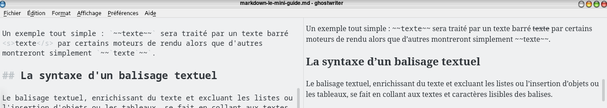
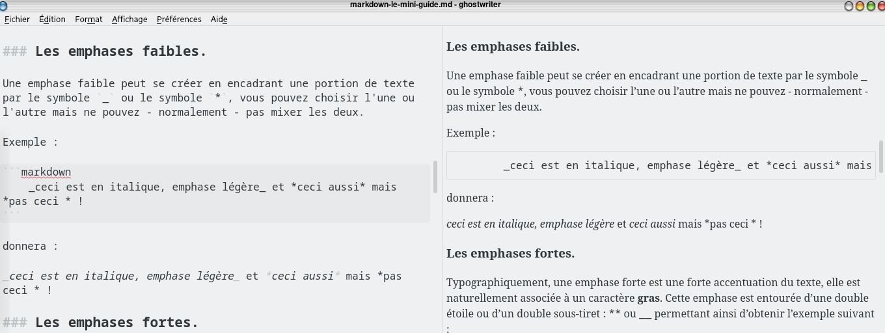
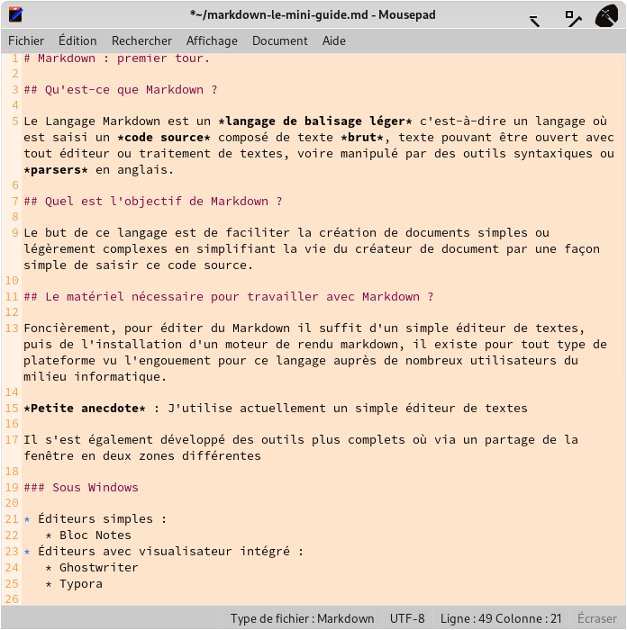
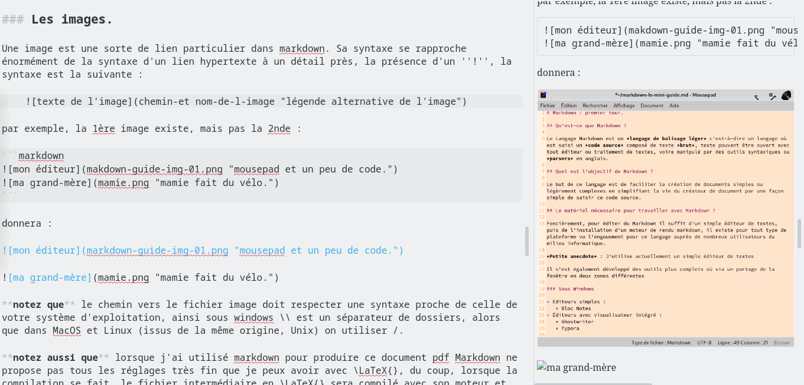
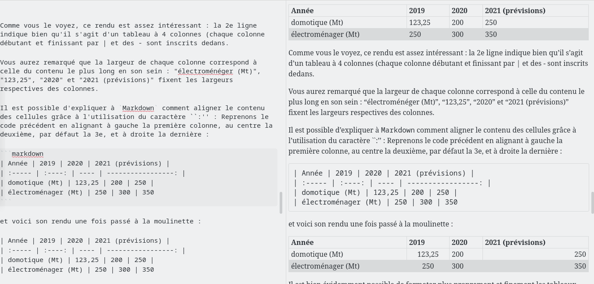
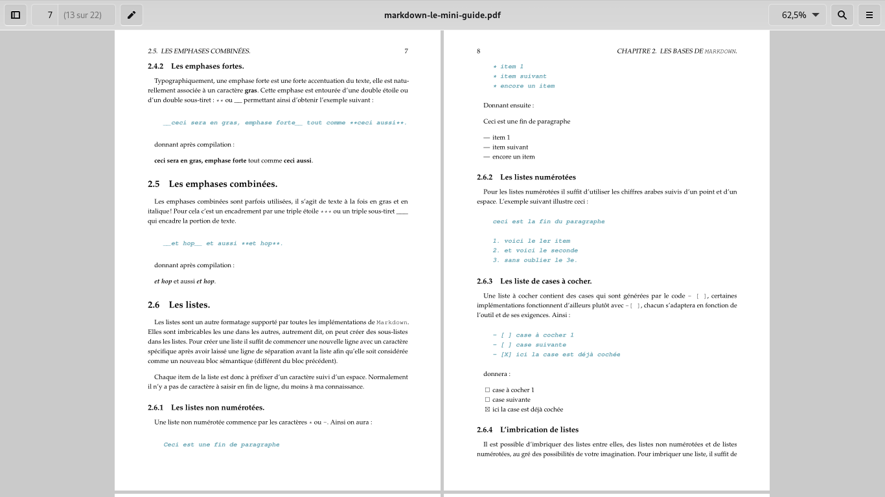
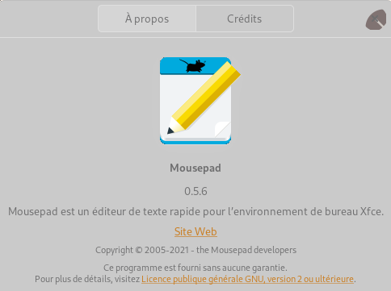
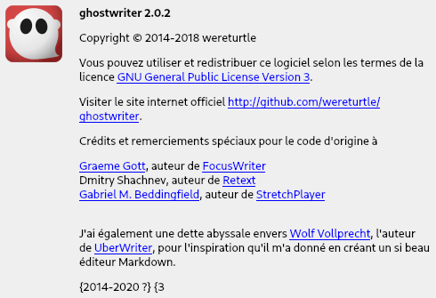

# `Markdown` : Une vue d'ensemble.

## Qu'est-ce que `Markdown` ?

Le Langage `Markdown` est un *langage de balisage léger* c'est-à-dire un langage où est saisi un *code source* composé de texte *brut*, texte pouvant être ouvert avec tout éditeur ou traitement de textes, voire manipulé par des outils syntaxiques ou *parsers* en anglais.

Les caractères saisis sont souvent supportés dans l'un des codages universels en informatique, appelé UTF-8.

Pour les personnes non familières, la notion de *code source* renvoie à la programmation informatique où le programme qui s'exécute[^application] est un fichier binaire contenant des 0 et de 1 incompréhensibles pour un humain, et le code source est un texte humainement compréhensible pour les initiés. La notion de code source est une grande invention introduite dans les années 1960 par **Grace Hopper** qui créa le premier *compilateur*[^compilateur] dont le rôle est de traduire le code source en exécutable binaire. À partir de ce moment là le programmeur n'a plus besoin de traduire en langage machine (la suite de 0 et 1 compréhensible par l'ordinateur) son programme et de le saisir directement ainsi dans l'ordinateur : il écrit un code humainement lisible, le compilateur se charge alors de le traduire automatiquement en langage machine compréhensible par l'ordinateur.

## Quel est l'objectif de `Markdown` ?

Le but de ce langage est de faciliter la création de documents simples ou légèrement complexes en simplifiant la vie du créateur de document par une façon aisée et relativement élégante de saisir ce code source. Attention cependant, ce fonctionnement peut être très déroutant si vous ne dissociez pas dans votre esprit la forme et le fond ; lorsque l'on saisit le code source du document en Markdown avec un outil ultrabasique tel qu'un simple bloc-notes, le formatage n'est pas rendu immédiatement[^formatagedirect].

`Markdown` n'est pas un traitement de textes au sens actuel communément admis. Il ne se comporte pas comme `Word` de *Microsoft*, `Writer` de *Libreoffice* ou encore `Pages` de *Apple*, ce langage ne se comporte pas comme ces traitements de textes classés dans la famille des **wysiwyg**[^wysiwyg] mais plutôt du **wyciwym**[^wyciwym] ; 
il doit être compris comme un document qui contient des balises sémantiques, c'est-à-dire des marques indiquant le sens du texte écrit, encadrant ou précédent un bloc ou une ligne de texte.

En découplant l'esthétique du sens, vous pouvez ainsi travailler sur le document plus librement, vous déchargeant l'esprit, en réduisant le formatage au plus simple et en se concentrant sur le sens, puis ensuite créer le document formaté. Ce découplage permet d'ailleurs d'autres aspects environnementaux intéressants, j'y reviendrai ultérieurement dans [markdown et environnement]{#markdown-environnement}.

Il existe d'autres formes de langages sémantiques, le plus connu est le *HTML* des pages web, qui depuis a longtemps été étendu par d'autres tels que JavaScript, PHP, etc..., et dans le domaine de la publications comment ne pas citer \LaTeX{} ou encore `asciidoc`.

L'éditeur spécial markdown utilise un autre outil qu'il intègre de façon transparente pour l'utilisateur, ce que je désignerai par l'expression de *moteur de rendu*.

Vous pourrez notez qu'avec le temps et la pratique au moins deux situations différentes non-exclusives s'ouvriront à vous :

+ vous aurez atteint un niveau suffisant de compréhension du markdown, modifiant votre perception du code que vous pourrez lire quasiment directement sans avoir besoin de rendu, je vous avoue que ça m'arrive même désormais avec \LaTeX{}.
+ vous finirez au gré des échanges par trouver un éditeur qui offrira une visualisation directe séparée - comme ghostwriter ou retext - ou directe - typora, abricotine, apostrophe - de ce que vous saisissez, certains ayant même des icônes, à la façon d'un Libreoffice ou d'un Office, pour formater.

## Le matériel nécessaire pour travailler avec `Markdown` ?

Foncièrement, pour éditer du `Markdown` il suffit d'un simple éditeur de textes[^editor], puis de l'installation d'un moteur de rendu markdown, il existe pour tout type de plateforme vu l'engouement pour ce langage auprès de nombreux utilisateurs du milieu informatique.

*Petite anecdote* : J'utilise actuellement un simple éditeur de textes, appelé *mousepad*, qui est très simple dans ses fonctionnalités mais contient exactement celles dont j'ai besoin pour écrire ou programmer.

Il s'est également développé des outils plus complets où via un partage de la fenêtre en deux zones différentes.

### Multiplateformes

Plutôt que de les inclure dans leur système respectif, je pose ici les logiciels et leur site de référence lorsque ceux ci-sont développés sur plusieurs plateformes en reprenant les indications des sites le jour où je les ai inclus ou le jour ou je les ai revérifiés :

+ abricotine <http://abricotine.brrd.fr/> , MacOSX (en béta), Linux et Windows (7 ou +), attention, lorsque je l'ai compilé sur un ordinateur pour le tester, il a fallu installer *nodejs* ce qui me semble relativement lourd.
+ typora <https://typora.io> est un logiciel qui formate à la volée le code que vous saisissez
+ ghostwriter <https://wereturtle.github.io/ghostwriter/> un éditeur où s'affiche par défaut le code mais permet aussi de scinder la fenêtre en deux pour avoir le rendu à droite. C'est *aussi* celui que j'utilise.

### Sous Windows

* Éditeurs simples :
	* Bloc Notes

### Sous Mac OS

* Éditeurs simples :

### Sous Linux

* Éditeurs simples :
	* emacs
	* vi, vim, gvim, neovim,
	* nano
	* etc... (il existe des dizaines d'éditeurs simples)
	* Leafpad
	* Geany
	* Mousepad
	* Apostrophe (partie des GNOME-Apps)
	* GEdit
	* Pluma
* Éditeurs avec visualisateur intégré :
	* ReText
	* SublimeText (demande un numéro de licence à acheter)
	* Abricotine
	* Apostrophe

Les éditeurs de texte permettent de saisir du code, c'est à dire un texte fait de caractères bruts ou codés de façon totalement universelle. Un code écrit avec n'importe quel éditeur peut être ouvert avec n'importe quel autre ou un traitement de textes ...

### Markdown et environnement : un peu de légèreté. {markdown-environnement}

L'informatique est connue pour être un secteur coûteux et *extrêmement* polluant. Tout le monde n'a pas les moyens de se payer un ordinateur récent et puissant aussi souvent que les programmes les plus *en vogue* demandent des ressources, mais nombre d'utilisateurs ont des ordinateurs un peu voire très âgés, c'est un phénomène constaté au quotidien.

Grâce à ce type d'outil que sont les éditeurs **wyciwym** vous pouvez utiliser un ordinateur même hors d'âge -- sans exagérer non plus -- pour composer le contenu ou sa plus grosse partie et compiler ensuite le rendu sur place ou sur un poste un peu plus puissant, l'éditeur étant normalement et sauf exception, un programme d'empreinte énergétique faible nécessitant des ressources matérielles modestes.

L'utilisation d'un simple éditeur de textes, tels que mousepad, leafpad, gedit, emacs, kate, pluma, geany, vi(m) ... permet de travailler avec une empreinte énergétique légère. La tendance actuelle évolue cependant : on commence à avoir des éditeurs au rendu direct -- ou pas -- consommant de plus en plus de ressources énergétiques. Tant que la liberté est laissée et que chaque personne a *le choix* de pouvoir utiliser l'une ou l'autre des solutions pour composer rien ne vient me gêner.

*Petite anecdote* : Je compose sur une machine de 12 ans d'âge où la seule modification a été d'augmenter la mémoire vive afin qu'il exécute un système récent.

Pour produire ce document, l'éditeur qui est utilisé près de 95 % du temps utilise peu de puissance, lorsque j'ai besoin de voir le rendu, le code source de ce document est alors passé dans une moulinette automatique double qui va le transformer en document tel que vous le lisez. Certaines captures d'écran ultérieures vous montreront des exemples de code source / rendu avec l'un des logiciels que j'utilise.

# Les bases de `Markdown`.

Dans cette partie sont vues les principes et objectifs de `Markdown` ainsi que les éléments de base de formatage des documents avec les balises usuelles et leurs variantes.

## Généralités et objectifs

Le langage `Markdown` sait prendre en charge des formatages simples, il peut ainsi travailler avec des emphases plus ou moins fortes, des listes numérotées ou non, des cases à cocher ou des tableaux élémentaires ainsi que l'insertion de liens ou d'images, mais aussi l'insertion de citations, de bouts de codes ou de listings informatiques et quelques spécificités. Ces syntaxes basiques peuvent être augmentées par l'ajout d'autres codes issus de langages différents, ceci sera traité à la partie idoine.

Dans cette partie j'exposerai les formatages basiques concernés. Il est important de comprendre qu'ici certains *mauvais* réflexes sont à perdre. Ainsi je ne parlerai pas d'italique mais d'emphase légère et je ne parlerai plus de gras mais d'emphase forte. Ces terminologies sont issues de la typographie classique, qu'on retrouve également dans d'autres langages tels que \TeX{}, \LaTeX{} ou CON\TeX{} par exemple.

Avant de poursuivre, notez que `Markdown` est un langage qui a été développé un peu par à-coups, son côté minimaliste et sa licence libre en a fait un langage *forké*, il existe de nombreuses implémentations de `Markdown` qui sont désignées comme des ``saveurs'' (*flavours* en anglais). Cela se traduit par un fait simple : parfois certains éditeurs ou moteurs de rendu ne traduisent pas toutes les balises car ils s'appuient sur une saveur n'implémentant pas cette balise.

Un exemple tout simple : `~~texte~~` sera traité par un texte barré <s>texte</s> par certains moteurs de rendu alors que d'autres montreront simplement `~~`texte`~~`. D'ailleurs la figure "Même aperçu de balisage dans ghostwriter" vous montre une capture d'écran partielle permettant de voir un balisage où le texte est bien barré par l'utilisation des balises `~~`



## La syntaxe d'un balisage textuel

Le balisage textuel, enrichissant du texte et excluant les listes ou l'insertion d'objets ou les tableaux, se fait en collant aux textes et caractères lisibles des balises.

**Attention :** Un espace n'est pas un caractère pour le balisage, aussi si vous voulez mettre en italique le mot bidule par exemple, ce code-ci `*bidule*` fonctionnera alors que celui-là `*bidule *` ne fonctionnera pas du fait de la présence d'un espace.

## Les titres, sous-titres et organisation hiérarchique.

Chaque ligne de titre, sous-titre, sous-sous-titre etc... jusqu'au 5e ou 6e niveau hiérarchique suivant les logiciels et implémentations est à préfixer avec un ou plusieurs caractères `#`.

Ainsi `# le titre` sera le titre du document, `## le sous-titre` le sous-titre, etc... Voici un exemple de code que je ne génèrerai pas visuellement pour ne pas perturber la numérotation des paragraphes en cours :

```markdown
	# titre du document
	
	bla bla bla
	
	## sous titre 
	
	re bla bla bla 
	
	## autre sous-titre
	
	### sous-sous titre
	
	bla bla bla bla
	
	### encore un sous-sous titre
	
	bla bla bla
	
	## un dernier sous-titre
	
	bla bla bla
```

Lors de la compilation, les hiérarchies de titres ne sont pas numérotées, sauf à passer le paramètre `--number-sections` à la commande en charge de la compilation du document. C'est ce qui a été fait ici pour la numérotation de toutes les sections, sous-sections et sous-sous-sections, les titres principaux ayant été attribués par une commande supplémentaire aux titres de chapitres.

## Les paragraphes

Un paragraphe dans markdown commence à un début de ligne. Une fois le paragraphe fini, il suffit de sauter deux lignes pour commencer le suivant.

Exemple :

```markdown
Ceci est un début de paragraphe bla bla bla bla bla ...
	
Ceci est le paragraphe suivant bla bla bla bla bla ...
```

donnera :

Ceci est un début de paragraphe bla bla bla bla bla ...
	
Ceci est le paragraphe suivant bla bla bla bla bla ...

J'ai souvent tendance à considérer les paragraphes comme un bloc sémantique, *ou objet*, tout comme une liste en est un autre, une image aussi.

## Les emphases.

Les enphases sont typographiquement des mises en valeur de portions de textes. Ces emphases sont *faibles* ou **fortes** et peuvent se coder de deux façons différentes.

### Les emphases faibles.

Une emphase faible peut se créer en encadrant une portion de texte par le symbole `_` ou le symbole `*`, vous pouvez choisir l'une ou l'autre mais ne pouvez - normalement - pas mixer les deux.

Exemple :

```markdown
_ceci est en italique, emphase légère_ et *ceci aussi* ¬
 mais *pas ceci * et encore moins *ceci_ !
```

donnera :

_ceci est en italique, emphase légère_ et *ceci aussi* mais *pas ceci * et encore moins *ceci_ !

La compilation via *pdflatex* pour obtenir le document *pdf* semblant parfois avoir un comportement non conforme à celui attendu par un moteur de rendu html, la capture "Emphases faibles dans ghostwriter" vous montrera à sa droite un aperçu plus conforme à la norme `Markdown`.



### Les emphases fortes.

Typographiquement, une emphase forte est une forte accentuation du texte, elle est naturellement associée à un caractère **gras**. Cette emphase est entourée d'une double étoile ou d'un double sous-tiret : `**` ou `__` permettant ainsi d'obtenir l'exemple suivant :

```markdown
__ceci sera en gras, emphase forte__ tout comme **ceci aussi**.
```

donnant après compilation :

__ceci sera en gras, emphase forte__ tout comme **ceci aussi**.

## Les emphases combinées.

Les emphases combinées sont parfois utilisées, il s'agit de texte à la fois en gras et en italique ! Pour cela c'est un encadrement par une triple étoile `***` ou un triple sous-tiret `___` qui encadre la portion de texte.

```markdown
___et hop___ et aussi ***et hop***.
```

donnant après compilation :

___et hop___ et aussi ***et hop***.

## Les listes.

Les listes sont un autre formatage supporté par toutes les implémentations de `Markdown`. Elles sont imbricables les une dans les autres, autrement dit, on peut créer des sous-listes dans les listes. Pour créer une liste il suffit de commencer une nouvelle ligne avec un caractère spécifique après avoir laissé une ligne de séparation avant la liste afin qu'elle soit considérée comme un nouveau bloc sémantique (différent du bloc précédent).

Chaque item de la liste est donc à préfixer d'un caractère suivi d'un espace. Normalement il n'y a pas de caractère à saisir en fin de ligne, du moins à ma connaissance.

### Les listes non numérotées.

Une liste non numérotée commence par les caractères `*`, `+` ou `-`. Ainsi on aura :

```markdown
Ceci est une fin de paragraphe

* item 1
* item suivant
* encore un item
```

Donnant ensuite :

Ceci est une fin de paragraphe
	
* item 1
* item suivant
* encore un item

### Les listes numérotées

Pour les listes numérotées il suffit d'utiliser les chiffres arabes suivis d'un point et d'un espace. L'exemple suivant illustre ceci :

```markdown
ceci est la fin du paragraphe

1. voici le 1er item
2. et voici le seconde
3. sans oublier le 3e.
```

Ce qui donnera le rendu suivant :

ceci est la fin du paragraphe

1. voici le 1er item
2. et voici le seconde
3. sans oublier le 3e.

### Les liste de cases à cocher.

Une liste à cocher contient des cases qui sont générées par le code `- [ ] `, certaines implémentations fonctionnent d'ailleurs plutôt avec `-[ ] `, chacun s'adaptera en fonction de l'outil et de ses exigences. Ainsi :

```markdown
- [ ] case à cocher 1
- [ ] case suivante
- [X] ici la case est déjà cochée
```

donnera le visuel suivant :

- [ ] case à cocher 1
- [ ] case suivante
- [X] ici la case est déjà cochée

Vous me demanderez peut-être pourquoi cette dernière case cochée (je le vois dans votre regard sur l'écran) ? Tout simplement car il existe des programmes ou des applications qui permettent de créer des listes dynamiques (tâches, courses, ...) s'appuyant sur `Markdown` permettant dans un mode de visualisation de cocher ou décocher les cases.

### L'imbrication de listes

Il est possible d'imbriquer des listes entre elles, des listes non numérotées et de listes numérotées, au gré des possibilités de votre imagination. Pour imbriquer une liste, il suffit de décaler par tabulation les lignes avant de commencer à saisir le balisage. Par exemple :

```markdown
1. bla bla truc
2. machin chose
	1. exemple
	2. autre exemple.
3. exacte solution
	* sous exemple
	* sous exemple suivant sans ordre
4. traitement du n'importe quoi
	1. sous exemple
	2. autre sous exemple
		* encore un exemple
		* sans oublier celui-ci
	3. Continuons.
5. revenons au début.
```

donnera :

1. bla bla truc
2. machin chose
	1. exemple
	2. autre exemple.
3. exacte solution
	* sous exemple
	* sous exemple suivant sans ordre
4. traitement du n'importe quoi
	1. sous exemple
	2. autre sous exemple
		* encore un exemple
		* sans oublier celui-ci
	3. Continuons.
5. revenons au début.


## Les liens et images.

Il peut sembler étrange que je range dans la même partie les liens et les images, n'en soyez pas étonné(e), cela vient simplement du formatage utilisé par `Markdown` pour les insérer dans le document.

Avant de commencer ce document, je tiens à signaler que le caractère "¬" qui apparaît parfois dans les listings de code sert à signaler que la ligne de code continue à la ligne suivante mais est saisie en continu dans le monde réel.

Dernier point avant d'attaquer ce qui suit : la conversion par `pdflatex` calcule la position optimale d'une image dans un document afin de rendre son contenu agréable à l'œil, aussi certaines images peuvent ne pas être à l'endroit espéré mais une ou deux pages avant ou après.

### Les liens (web entre autres)

Un lien - on supposera vers internet - suit la syntaxe suivante :

	[texte clicable](url-du-lien "texte alternatif")

Par exemple :

	[Markdown sur Wikipedia](https://fr.wikipedia.org/wiki/Markdown "Page wikipedia consacrée à Markdown")

Donne (le lien ci-dessous est actif, cliquable et peut-être même coloré) un lien que vous pouvez constater car en le survolant avec le curseur de la souris, celle-ci passera de :

[Markdown sur Wikipedia](https://fr.wikipedia.org/wiki/Markdown "Page wikipedia consacrée à Markdown")

Parfois cependant, vous souhaiterez utiliser un lien directement cliquable et visible, vous comprenez facilement qu'écrire quelque chose comme :

	[https://le-site-web](https://le-site-web "https://le-site-web")

est fastidieux, heureusement il existe une syntaxe simplifiée de lien pour cette situation-là :

	<https://le-site-web>

Voici un exemple simple pour le site de la NASA, le code source sera :

	<https://www.nasa.gov/>

Et voici son rendu : <https://www.nasa.gov/>

**Notez que** le programme de visualisation du document, qu'il soit en rendu HTML ou que vous l'ayez converti en autre chose (docx, odt, pdf) ouvrira *votre navigateur par défaut*, soyez donc prudent si ce dernier n'est pas à jour.

**Notez aussi que** les liens ne sont pas forcément visibles par défaut, ce document (pdf) n'affiche pas les liens par défaut si on ne lui passe pas des paramètres particuliers et des fichiers annexe, voir le chapitre consacré aux réglages et options avancées.

### Les liens vers des titres de paragraphes.

Il est possible d'ajouter des liens associés à des paragraphes, la syntaxe est alors simple : autant de dièses que nécessaires pour le niveau hiérarchique suivi du titre du paragraphe et entre accollades sont identifiant de lien. Voici un exemple :

	### titre de mon paragraphe test {id-test}

Plus loin dans le texte, pour faire référence à ce paragraphe, il suffit d'utiliser un lien pointant vers lui :

	voir le [paragraphe test](#id-test)

*Anecdote* : lors de la compilation de ce document, ces balises sont crées afin de créer une table des matières.

### Les images.

Une image est une sorte de lien particulier dans markdown. Sa syntaxe se rapproche énormément de la syntaxe d'un lien hypertexte à un détail près, la présence d'un ''!'', la syntaxe est la suivante :

	

par exemple, la 1ère image existe, mais pas la 2nde :

```markdown


```

donnera une image (mon éditeur) et une image absente visible par son texte (ma grand-mère), attention, l'image peut avoir été déplacée à plus ou moins une ou deux pages avant ou après :




L'image "Aperçu dans ghostwriter d'une image absente" vous montre à sa droite en bas, l'aperçu d'une image manquante dans un logiciel dédié à markdown, à savoir `ghostwriter`, qui ne permet certes pas l'impression, mais qui permet la visuation HTML intégrée.



**notez que** le chemin vers le fichier image doit respecter une syntaxe proche de celle de votre système d'exploitation, ainsi sous windows \\ est un séparateur de dossiers, alors que dans MacOS et Linux (issus de la même origine, Unix) on utiliser /.

**notez aussi que** lorsque j'ai utilisé markdown pour produire ce document pdf Markdown ne propose pas tous les réglages très fin que je peux avoir avec \LaTeX{}, du coup, lorsque la compilation se fait, le fichier intermédiaire en \LaTeX{} sera compilé avec son moteur et calculera de lui-même la meilleure place pour positionner les images.

## Les tableaux élémentaires.

Les tableaux simples sont aussi supportés par certaines versions de markdown, pas toutes, dans toutes les implémentations le supportant, sachez cependant que la gestion de l'espace occupée par les cellules est calculée par le contenu le plus long, et que si le tableau déborde de la feuille, `markdown` le fera déborder ! À vous de gérer cela correctement !


### Le tableau le plus simple :

Voici un exemple de code pour un tableau élémentaire :

```markdown
| Année | 2019 | 2020 | 2021 (prévisions) |
| ----- | ---- | ---- | ----------------- |
| domotique (Mt) | 123,25 | 200 | 250 |
| électroménager (Mt) | 250 | 300 | 350 |
| jardinage (Mt) | 102 | 155 | 201 |
```

et voici son rendu une fois passé à la moulinette :

| Année | 2019 | 2020 | 2021 (prévisions) |
| ----- | ---- | ---- | ----------------- |
| domotique (Mt) | 123,25 | 200 | 250 |
| électroménager (Mt) | 250 | 300 | 350 |
| jardinage (Mt) | 102 | 155 | 201 |

Comme vous le voyez, ce rendu est assez intéressant : la 2e ligne indique bien qu'il s'agit d'un tableau à 4 colonnes (chaque colonne débutant et finissant par | et des - sont inscrits dedans.

Vous aurez remarqué que la largeur de chaque colonne correspond à celle du contenu le plus long en son sein : "électroménéger (Mt)", "123,25", "2020" et "2021 (prévisions)" fixent les largeurs respectives des colonnes.

Il est possible d'expliquer à `Markdown` comment aligner le contenu des cellules grâce à l'utilisation du caractère ``:'' : Reprenons le code précédent en alignant à gauche la première colonne, au centre la deuxième, par défaut la 3e, et à droite la dernière :

```markdown
| Année | 2019 | 2020 | 2021 (prévisions) |
| :----- | :----: | ---- | -----------------: |
| domotique (Mt) | 123,25 | 200 | 250 |
| électroménager (Mt) | 250 | 300 | 350 |
| jardinage (Mt) | 102 | 155 | 201 | 
```

et voici son rendu une fois passé à la moulinette :

| Année | 2019 | 2020 | 2021 (prévisions) |
| :----- | :----: | ---- | -----------------: |
| domotique (Mt) | 123,25 | 200 | 250 |
| électroménager (Mt) | 250 | 300 | 350 |
| jardinage (Mt) | 102 | 155 | 201 |

Il est bien évidemment possible de formater plus proprement et finement les tableaux grâce à des options avancées auxquelles je n'ai pas encore jeté il œil. De même, l'alignement de chaque tableau au centre provient du traitement automatique par défaut des tableau par LaTeX{} lors de la conversion.

**Notez que** le nombre de caractères à mettre dans la 2e ligne est au moins 3 quitte à en ajouter plus pour que le code soit visuellement plus clair à déchiffrer par l'œil humain. Ainsi `---` suffirait pour un formatage par défaut, `:--` pour un alignement à gauche, `:-:` pour un centrage et `--:` pour un alignement à droite.

**Notez aussi que** si dans ce document pdf les tableaux ont un aspect, dans un outil dédié à `Markdown` tel que ghostwriter, les lignes alternent les colorations afin d'améliorer la lisibilité comme vous le constatez à droite de la capture de l'image "tableaux dans ghostwriter"



## Les citations.

Le langage `markdown` permet d'insérer des citations venant d'autres supports ou que l'on souhaite mettre en valeur de façon différente pour les repérer. Ces citations sont à préfixer par le caractère `>`.

Le code suivant :
```markdown
texte normal qui précède la citation

> Ceci est une citation

> > Ceci est une citation de citation

> et ceci est à nouveau une citation

texte normal qui suit la citation
```

donnera :

texte normal qui précède la citation

> Ceci est une citation

> > Ceci est une citation de citation

> et ceci est à nouveau une citation

texte normal qui suit la citation

Vous aurez noté que l'aspect est subtil dans le livre compilé, mais avec un logiciel dédié à markdown on aura des signes plus explicites (à droite de l'image) :


## Les codes et listings (blocs de code)

Markdown est un langage qui a été développé par des développeurs, initialement pour des développeurs, c'est à dire des gens qui souhaitent être efficaces en saisisant du code informatique, aussi l'une des fonctionnalités les plus évidentes consiste à pouvoir insérer des blocs de commandes ou des listings de commandes afin de communiquer entre développeurs, ceci de façon rapide.

Le caractère qui est utilisé pour cette tâche est l'accent grave seul :

	`

ainsi en encadrant un mot ou un bloc de mots :

	`exemple`

	`encore un autre exemple`

on obtiendra :

`exemple`

`encore un autre exemple`

Il est également possible pour une ou plusieurs lignes d'activer ce mode de listing ou code en commençant la ligne par une tabulation (mais non suivie d'une étoile ou d'un - sinon cela serait peut-être interprété comme un début de lites à puces.

Ainsi :

	```langage
	code 1
	code 2
	ligne de code 3
	```
donnera :
```
code 1
code 2
ligne de code 3
```

``langage'' n'est pas du tout obligatoire, mais permet si l'éditeur est très convivial, de colorer les commandes d'après la syntaxe correspondante au langage précisé. Par exemple pour du python, voici le code source :

	```python
	
	import numpy as np
	index=0
	print("Hello world !")
	while index<=10:
		print("L'indice actuel est : ",index)
		index+=1
	print("merci")		
	```

et voici son rendu :

```python

	import numpy as np
	index=0
	print("Hello world !")
	while index<=10:
		print("L'indice actuel est : ",index)
		index+=1
	print("merci")
```

Comme vous le constatez, le rendu contient des parties colorées

# Aller plus loin avec `Markdown`

**Rappel** : `Markdown` n'est qu'une version simplifiée du *HTML*, il est donc capable de gérer les balises html classiques. Pour aller plus loin avec `Markdown` il faut toujours garder à l'esprit la finalité, en effet les extensions complétant ce langage dépendent de l'objectif final et du support.

Par exemple, le rendu de ce docuument sur une des plateformes participatives utilisant *git*[^git], telles que *gitea*, *github* ou *gitlab*, n'aura pas le même rendu et n'offrira pas les mêmes possibilités d'extension que la génération de ce document en *PDF*.

## L'insertion d'une table des matières

`Markdown` est aussi utilisé dans les *Wikis* sur les grandes interfaces web d'utilisation de *git* que sont le site *github*, le moteur ou le site *gitlab* ou encore le moteur *gitea*, et dans les conseils donnés, souvent, apparaît l'intertion d'une table d'indexe qui est placé à l'endroit où la commande :

```markdown
	[[_TOC_]]
```

TOC signifiant évidemment *Table Of Contents*.

**A Noter : ** Cette table des matières ne fonctionne pas tout le temps, en l'occurrence elle fonctionne très bien sur la version de markdown *saveur* github[^githubflavoredmarkdown].

## L'insertion de caractères étendus

Par défaut, `Markdown` se veut une version simplifiée du langage HTML utilisé dans les pages web, aussi accepte-t-il facilement les caractères étendus ...

## Les notes de bas de page

Les notes de bas de page, ou plutôt dans `Markdown` de fin de document, sont à placer par la combinaison de caractères `[^quelquechose]` suite au mot qui doit être explique, et par une ligne débutant par `[^quelquechose]: ` par la suite. Arrangez-vous pour que ces références `quelquechose` soient uniques au sein du document.

À plusieurs occasions dans ce document j'ai placé quelques notes de bas de page, lorsque l'explication est placée près du texte, le rendu est mauvais lors de la compilation en html, mais bon avec des éditeurs/visualisateurs de Markdown dédiés, aussi ai-je fini par les placer à la fin du document, et dès ce moment-là la compilation du document final a généré correctement les notes en bas des pages correspondantes.

## L'insertion de formatages étendus

L'insertion de formatage étendus peut se faire de plusieurs façons et à différents niveaux, tout dépend de la finalité et du document final souhaité.

### Au niveau du code.

Suivant le moteur de rendu (webengine pour le HTML, pdflatex pour les pdf) les balises de formatages manquantes à `Markdown` se sont ajoutées, évidemment, si elles concernent du formatage compréhensible par le moteur, il l'interprétera, ainsi la balise permettant de mettre du texte en exposant, à savoir `<sup>texte</sup>` ne sera comprise que par un moteur webengine dans un logiciel qui l'appelle pour générer un aperçu.

Si le moteur est autre, comme pandoc + pdflatex, la balise ne sera pas comprise et le texte sera au mieux écrit normalement ou entourer des caractères de balisage, au pire, absent.

Par contre, un balisage comme `^texte^` s'il est compris par le moteur, affichera bien le texte en l'air.

Les formatages étendus sont complexes à tous détailler car dépendant à la fois des normes de `Markdown` comprises par le logiciel, que par son moteur de rendu et donc sa finalité.

Un code tel que :

	texte^en l'air^~en bas~<sup>en l'air</sup><sub>en bas</sub>

sera interprété différemment par le compilateur et son moteur de rendu.

Exemple :

texte^en l'air^~en bas~<sup>en l'air</sup><sub>en bas</sub>

### Lors du transcodage / conversion interformats.

Il est possible de personnaliser le rendu, toujours suivant l'outil utilisé pour le transcodage, par l'ajout de fichiers complémentaires ou de lignes non apparentes au sein du code.

Un rendu par WebEngine/HTML utilisera un fichier *Cascades Style Sheet* ou *CSS* qui contiendra des informations pour le formatage visuel de la sémantique. Ce fichier peut être inclus dans le code source, ou bien gardé à part dans un fichier qui peut être appelé pour la génération du visuel final, permettant ainsi d'avoir une charte visuelle homogène sur un projet multifichiers.

Concernant le rendu pandoc/pdflatex il est possible d'ajouter le contenu d'un fichier auxiliaire dans les entêtes du fichier .tex intermédiaire (*headers*), modifiant par exemple la police par défaut, la taille du papier ou des caractères, l'espacement interligne ou entre paragraphe, les marges, etc...

La documentation en ligne vous permettra de créer ainsi à partir d'un document simple comme du markdown, un document de qualité apprécié pour son homogénéité visuelle et ses possibilités.

**Notez que** c'est lors du transcodage de ce document qu'a été défini le format du papier, la police de caractères par défaut et sa taille ainsi que la classe du document, le formatage des liens etc...

## Équations et bout de codes issus d'autres langages de formatage.

Le langage `Markdown` n'est prévu que pour supporter des formatages et inclusions légères issues du langage de formatage du web appelé HTML[^html], certaines extensions sont ajoutables par l'utilisation d'autres moteurs tels que *webengine* ou *pdflatex* avec des rendus très différents parfois.

Donc _nativement_ `Markdown` ne sait pas gérer des équations ni des formules mathématiques, tout comme certains visualisateurs, ainsi si je souhaite saisir la formule de l'énergie cinétique d'un corps, qui est notée E~C~ et qui vaut la 1/2 multipliée par la masse "m" et la vitesse au carré v^2^ je n'aurai rien de bien visible.

Si j'utilise une visualisation ou une sortie en HTML, je pourrai m'en sortir par le code :

	E<sub>C</sub> = <sup>1</sup>/<sub>2</sub> x m x v<sup>2</sup>

Si utilise une sortie en pdf via pdflatex et pandoc je pourrai utiliser directement du code issu du \LaTeX{} qui sera interprété nativement lors de la deuxième conversion interne latex $\rightarrow$ pdf, le code qui suit :

	$$
		E_C = \dfrac{1}{2} \times m \times v^2
	$$

donnera une fois compilé :

$$
	E_C = \dfrac{1}{2} \times m \times v^2
$$

Je pourrai donc utiliser les balises `$$` ou `\[` ou encore un `\begin{equation}` si je souhaite que les équations soient numérotées.

## Créer des documents relativement complexes.

Vous lisez - normalement - un livre avec plusieurs chapitres n'est-il pas ? Si je vous disait que ce document a été généré à partir d'un seul fichier de code markdown et que le chapitrage, le formatage et des outils fins de présentation sont dus soit à la présence de fichiers annexes, soit au passage d'options à un outil de conversion de formats de document appelé `pandoc` me croiriez-vous ?

Si la réponse est affirmative bravo ! Si elle est négative c'est dommage ! La quasi-totalité de ce document a été généré à partir d'un unique document markdown en compilant avec la ligne de commande qui suit :

```bash
moane@balrog ~]$ pandoc -f markdown -t pdf markdown-le-mini-guide.md ¬
-o markdown-le-mini-guide.pdf --top-level-division=chapter ¬
--number-sections -H markdown-le-mini-guide-headers.heads ¬
-B markdown-le-mini-guide-before.tex
```

Le rendu ? En voici une capture d'écran :



Je vous explique rapidement la syntaxe qui hormis la position du premier terme suivant le caractère \$ n'a pas vraiment d'importance :

* `pandoc ` : nom de la commande à exécuter
* `-f markdown` : *from* (depuis) markdown, la liste des formats disponibles est accessible par la commande `pandoc --list-input-formats`
* `-t pdf` : *to* (vers) pdf, la liste des formats disponibles est accessible par la commande : `pandoc --list-output-formats`
* `markdown-le-mini-guide.md` : le nom du fichier à traiter
* `-o markdown-le-mini-guide.pdf` : *output* à envoyer vers le fichier dont le nom suit le `-o`
* `--top-level-division=chapter` : indique à pandoc que les balises `#` doivent être considérées comme des chapitres, et définit alors le document pdf qui sera généré comme un rapport ou un livre
* `--number-sections` : indique à pandoc que les sections et sous-sections sont à numéroter tout au long du document. Si la commande `--top-level-division` n'est pas précisée, la classe du document est alors **article** et a numérotation commence à la section "1."
* `-H markdown-le-mini-guide-headers.heads` : inclus le fichier dans les entêtes (*headers*) du document afin de modifier l'apparence, ici le fichier d'extention .heads contient une série de commandes de formatages en \LaTeX{} s'appliquant dans l'ensemble du document
* `-B markdown-le-mini-guide-before.tex` : inclus le fichier (ici .tex) au début du corps du document généré, avant le code source. Dans l'exemple de ce manuel, cela a inclus la page de titre, celle avec la table des matières ainsi que celle avec la liste des figures.

Bien sûr d'autres options sont disponibles, il suffit d'ouvrir un terminal et de saisir la commande :

	man pandoc

pour pouvoir lire la documentation complète.

# Notices légales.

Ce document a été rédigé pour la quasi-totalité de son contenu en langage `markdown` afin que vous puissiez voir les possibilités natives de ce langage. 
C'est ainsi que j'ai utilisé un ordinateur manufacturé en 2008, dont seule la mémoire vive a été passée de 4 à 8 Go, système sur lequel tourne une version à jour d'`Arch linux` (en date du 4 sept. 2021) faisant tourner un environnement graphique `XFCe 4.16`.

Afin de me mettre dans les conditions les moins favorables à son fonctionnement j'ai décidé d'utiliser un éditeur graphique simple, `mousepad` version 0.5.6 fourni dans `XFCe` dont la capture d'écran est visible précédemment dans ce document dont la seule amélioration par rapport à un éditeur encore plus basique est la coloration syntaxique d'après le type de fichier détecté, aucune aide de saisie n'est offerte par cet outil.



Pour les fichiers de formatage fin j'ai utilisé des bouts de langage \LaTeX{} dans les entêtes (*headers*) et le fichier avant celui-ci (*before*) pour la page de présentation, le sommaire et la liste des figures incluses.

La compilation de ce document a été générée par `pandoc` :
```bash
pandoc 2.14.0.2
Compiled with pandoc-types 1.22, texmath 0.12.3, skylighting 0.10.5.1,
citeproc 0.4.0.1, ipynb 0.1.0.1
User data directory: /home/anonymous/.local/share/pandoc
Copyright (C) 2006-2021 John MacFarlane. Web:  https://pandoc.org
This is free software; see the source for copying conditions. There is no
warranty, not even for merchantability or fitness for a particular purpose.
```
Pour la conversion en \LaTeX{} il a été utilisé `pdflatex` aussi appelé `pdfTeX` :
```bash
pdfTeX 3.141592653-2.6-1.40.22 (TeX Live 2021/Arch Linux)
kpathsea version 6.3.3
Copyright 2021 Han The Thanh (pdfTeX) et al.
There is NO warranty.  Redistribution of this software is
covered by the terms of both the pdfTeX copyright and
the Lesser GNU General Public License.
For more information about these matters, see the file
named COPYING and the pdfTeX source.
Primary author of pdfTeX: Han The Thanh (pdfTeX) et al.
Compiled with libpng 1.6.37; using libpng 1.6.37
Compiled with zlib 1.2.11; using zlib 1.2.11
Compiled with xpdf version 4.03
```

Les captures d'écran ont été réalisées par l'outil `xfce4-screenshooter` livré avec `XFCe` et retouchées le cas échéant par l'éditeur de dessins `kolourpaint`.

Certaines captures d'écran montrent l'aperçu du code dans un éditeur dédié nommé ghostwriter :



Tous ces logiciels sont l'une des licences vertueuses et libre, ils sont légalement gratuits (même si la licence libre n'implique pas la gratuité).

[^application]: Dans la terminologie moderne où les *intelliphones* règnent en maîtres absolus dans une grand partie de la population, il n'y a plus vraiment de distinction entre la terminologie de programme, sous-entendu exécutable binaire, et application qui correspond à l'application d'un concept théorique sur une utilisation pratique.

[^compilateur]: Un compilateur est un exécutable (programme, application) dont le rôle est de traduire un code source humainement compréhensible en exécutable compréhensible par la machine. L'application contraire existe mais la décompilation d'un exécutable protégé par licence logicielle est le plus souvent interdite.

[^wysiwyg]: WYSIWYG : What You See Is What You Get (Ce que vous voyez est ce que vous aurez) ... *ou presque*. La majorité des logiciels de traitement de texte sont actuellement WYSIWYG, au fur et à mesure que vous saisissez votre document, il s'affiche à l'écran avec l'aspect qu'il devrait normalement avoir.

[^wyciwym]: WYCIWYM : What You Code Is What You Mean (Ce que vous voyez est le sens que vous lui donnez). Dans ce mode de fonctionnement, vous vous déchargez l'esprit de la présentation obtenue en vous concentrant sur le sens de ce qui est écrit, vous définissez vos sections, vos emphases, vos listes, vos tableaux ou autres graphiques plus ou moins complexes, et lors de la compilation du code source en document final, c'est le compilateur qui, en fonction des sens donnés et des paramètres de formatage définis dans les entêtes, se chargera de traduire au mieux votre pensée dans un document graphiquement homogène et agréable à parcourrir.

[^editor]: Un éditeur de textes est un programme qui écrit du texte simple, sans formatage. Son but est de manipuler du texte dit brut, en effectuant des recherches, des remplacement ou de l'édition. Sa caractéristique évoluant avec les usages récents, il peut cependant aussi montrer un formatage visuel pour aider l'utilisateur, formatage qui ne se traduit pas sur le document produit. Normalement son but est d'être léger en mémoire même si l'un des plus en vogue chez les programmeurs, *neovim* est très ... vorace en ressources.

[^html]: HTML pour HyperText Markup Language ou langage de balisage hypertextuel, utilisé pour générer des textes transformables en liens hypertexte. C'est ce simple outil qui a permis le développement du web moderne en liant les pages les unes aux autres.

[^git]: git (avec un g dur) est un système de gestion de versions de fichiers, décentralisé et très utilisé dans les milieux informatiques pour du développement en commun. <https://fr.wikipedia.org/wiki/Git>. D'après le magazine PC-World qui avait interviewé son concepteur, *git* qui est l'équivalent anglais de *connard* a été utilisé car l'auteur se considère un peu comme un sale égoïste et un connard.

[^formatagedirect]: Le formatage direct fait que vous voyez ce que vous tapez, ce qui ne se fait pas forcément dans un simple bloc-notes, cependant les choses changent puisque des blocs-notes augmentés montrent un formatage visuel, à l'instar des premiers traitements de textes tels que WordStar sous MS-DOS ou 4DOS par exemple. Graphiquement des logiciels tesl que *Typora* vous montrent le rendu en même temps que vous le saisissez, d'autres tels que *Ghostwriter* ont un mode où la fenêtre est coupée en deux parties adjacentes montrant l'une le code source, l'autre le rendu actualisé en permanence.

[^githubflavoredmarkdown]: Lorsque des variantes apparaissent en informatique, le terme souvent employé est le terme *flavour* -- saveur ou *fork* si le projet prend une nouvelle direction. Comme Markdown est un formatage allégé du HTML et que les spécifications n'ont pas vraiment été fixées, des développeurs ont alors implémenté des extensions de l'originale, créant par la même une saveur différente.